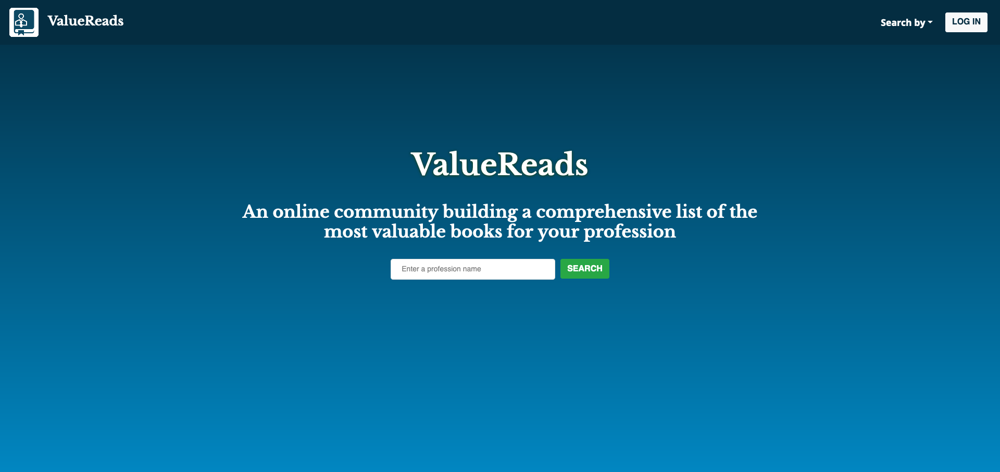

# ValueReads
An app for professionals who want to find out the most recommended books for their profession.
> - Maintained by: `ryan-griego`

## Live Demo
Url coming soon

## Technologies Used
  - HTML
  - CSS
  - JavaScript (ES6)
  - React.js
  - Node.js
  - Express
  - PostgreSQL
  - express-session
  - webpack
  - babel
  - Bootstrap 4

  ## Features
 1. User can search by profession.
 1. User view a list of recommended books by profession.
 1. User can view details about a book.
 1. User can add up to five books to their list.
 1. User can view a list of books they’ve added to their list.
 1. Users can delete a book from their book list.

 ## Preview
 
